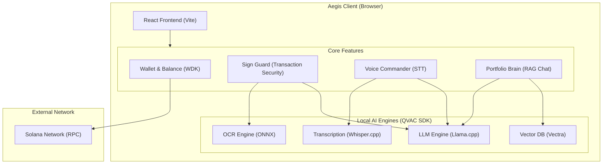
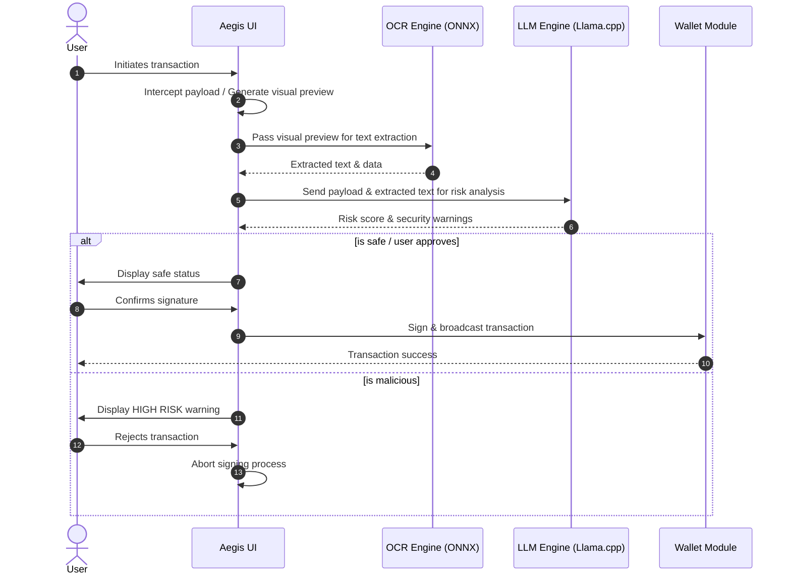
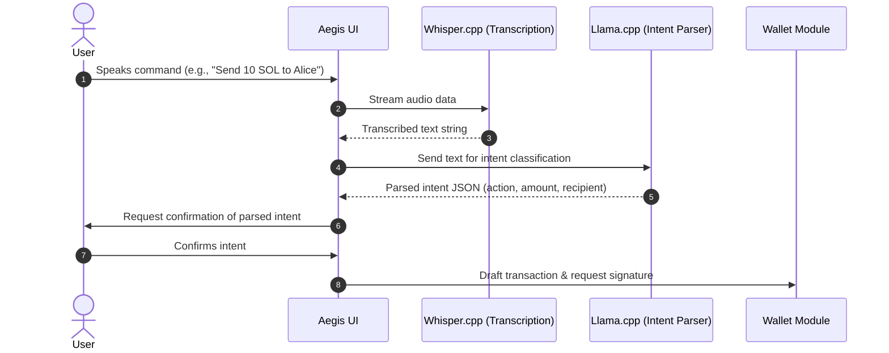

# Aegis

Sovereign, non-custodial Solana wallet with local-first AI: Sign Guard, Voice Commander, and Portfolio Brain.

## Requirements

- Node.js 18+
- pnpm
- Modern browser with WebGPU or WebAssembly support

## Architecture

Aegis is built as a fully local, sovereign, non-custodial Solana wallet. It runs entirely in the browser, leveraging WebAssembly (WASM) and WebGPU for on-device AI inference without relying on any external backend or cloud APIs.



## Workflows

### Sign Guard Workflow

Sign Guard protects users from malicious transactions by locally analyzing the transaction data before signing.



### Voice Commander Workflow

Voice Commander allows users to execute wallet operations using natural language speech.



## Setup

```bash
pnpm install
pnpm models:download
```

If you have custom QVAC OCR assets, place them under `public/models/ocr/`.

## Environment

Copy `.env.example` to `.env` and adjust if needed:

```bash
cp .env.example .env
```

If you want USDT transfers in devnet, set `VITE_USDT_MINT` to a devnet mint address.

## Run (Devnet)

```bash
pnpm dev
```

## Build

```bash
pnpm build
pnpm preview
```

## Project Structure

```
Aegis/
├── public/                 Static assets and models
│   └── models/             Local AI models (LLM, Whisper, OCR)
├── scripts/                Build and setup scripts
│   └── download-models.sh  Downloads required local AI models
├── src/                    Application source code
│   ├── app/                React App root, context providers, store
│   ├── components/         Reusable UI components
│   ├── features/           Core functional domains
│   │   ├── portfolio-brain/  RAG chat, vector embeddings (Vectra)
│   │   ├── sign-guard/       Transaction simulation, OCR, LLM analysis
│   │   ├── voice-commander/  Voice STT, intent extraction
│   │   └── wallet/           Solana WDK integration, balance management
│   ├── lib/                Shared utilities (logger, solana helpers)
│   ├── index.css           Global styles
│   └── main.tsx            Application entry point
├── package.json            Dependencies and project configuration
└── vite.config.ts          Vite build configuration
```

## Notes

- All AI inference runs locally via QVAC SDK modules.
- No telemetry or cloud inference is used.
- Default network is devnet.
- The bundled WDK package is a local devnet stub so installs work without private registry access.
- QVAC SDK packages are stubbed locally for this repo; replace with official packages when you have registry access.
