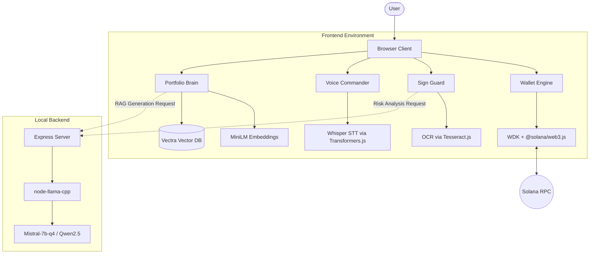
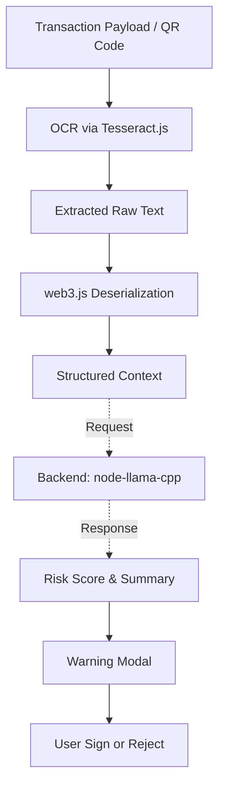
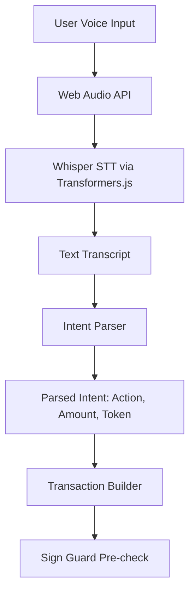
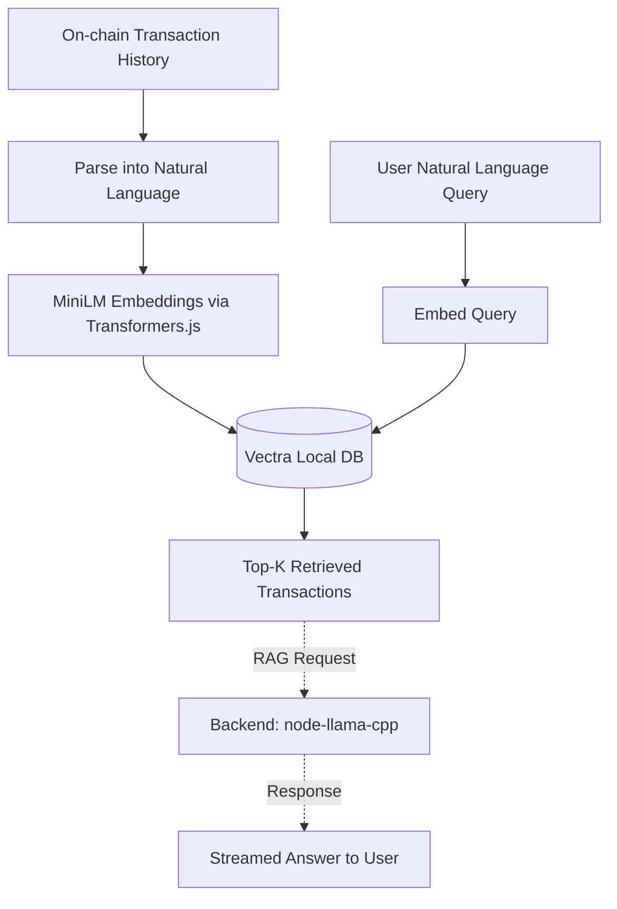

# Aegis

Sovereign, non-custodial Solana wallet with local-first AI: Sign Guard, Voice Commander, and Portfolio Brain.

All AI inference runs entirely locally using a combination of in-browser execution with Transformers.js (ONNX runtime) and Tesseract.js, along with a dedicated Node.js AI backend for heavy LLM inference. No telemetry. No cloud inference. Your keys and data never leave your local environment.

## Architecture



### Models Overview

| AI Component | Model | Engine | Size |
|---|---|---|---|
| LLM (Sign Guard / Portfolio) | Mistral-7b-q4 (or Qwen2.5-0.5B) | node-llama-cpp (Backend) | ~4 GB |
| Embeddings (Portfolio Brain) | all-MiniLM-L6-v2 | Transformers.js (Browser) | ~25 MB |
| Speech-to-text (Voice) | whisper-tiny.en | Transformers.js (Browser) | ~40 MB |
| OCR (Sign Guard upload) | eng traineddata | Tesseract.js (Browser) | ~10 MB |

Smaller models are downloaded from Hugging Face CDN on first use and cached in the browser's IndexedDB. The larger LLM runs locally via the Node.js backend.

## Core Features

### Sign Guard



### Voice Commander



### Portfolio Brain



## Requirements

- Node.js 18+
- A Solana RPC endpoint (see DEPLOY.md for provider options)
- Modern browser with WebAssembly support (Chrome 89+, Firefox 89+, Safari 15.2+)

## Setup

```bash
npm install
cp .env.example .env
# Edit .env and set VITE_SOLANA_RPC to your RPC endpoint
npm run dev
```

The `npm run dev` command will launch both the Vite frontend and the local Express backend concurrently.

Open http://localhost:5173. On first load the app initializes the local database and caches smaller models in the browser.

## Environment Variables

| Variable | Required | Description |
|---|---|---|
| `VITE_SOLANA_RPC` | Yes | Solana RPC endpoint URL |
| `VITE_SOLANA_NETWORK` | No | Label shown in UI (mainnet-beta or devnet). Default: mainnet-beta |
| `VITE_USDT_MINT` | No | SPL USDT mint address. Default: mainnet USDT |
| `VITE_QVAC_LOG_LEVEL` | No | Log level (error/warn/info/debug). Default: warn |

## Build

```bash
npm run build
npm run preview
```

## Deploy

See DEPLOY.md for step-by-step Vercel and Netlify deployment guides.

## License

MIT - see LICENSE.
