# Architecture

Aegis is built as a fully local, sovereign, non-custodial Solana wallet. It runs entirely in the browser, leveraging WebAssembly (WASM) and WebGPU for on-device AI inference without relying on any external backend or cloud APIs.

## High-Level Component Diagram

```mermaid
graph TB
    subgraph AegisApp["Aegis Client (Browser)"]
        UI["React Frontend (Vite)"]
        
        subgraph Features["Core Features"]
            WalletModule["Wallet & Balance (WDK)"]
            SignGuard["Sign Guard (Transaction Security)"]
            VoiceCmd["Voice Commander (STT)"]
            PortfolioBrain["Portfolio Brain (RAG Chat)"]
        end
        
        subgraph QVAC["Local AI Engines (QVAC SDK)"]
            Whisper["Transcription (Whisper.cpp)"]
            OCR["OCR Engine (ONNX)"]
            LLM["LLM Engine (Llama.cpp)"]
            VectorStore["Vector DB (Vectra)"]
        end
    end

    subgraph External["External Network"]
        SolanaRPC["Solana Network (RPC)"]
    end

    %% Internal Routing
    UI --> Features
    
    WalletModule --> SolanaRPC
    
    SignGuard --> OCR
    SignGuard --> LLM
    
    VoiceCmd --> Whisper
    VoiceCmd --> LLM
    
    PortfolioBrain --> LLM
    PortfolioBrain --> VectorStore

    %% Note for Local First
    classDef localfill fill:#1a1e2e,stroke:#9945FF,stroke-width:2px;
    class QVAC localfill;
```

## Component Breakdown

### 1. React Frontend
The user interface is built with React and Vite, using TailwindCSS for styling. It coordinates state management across the various local AI features and the Solana wallet.

### 2. Wallet Module
Uses the bundled `@tether/wdk` (Wallet Development Kit) to handle key management, signing, and fetching balances directly from the Solana RPC. Because it is non-custodial, private keys never leave the local environment.

### 3. Local AI Modules (QVAC SDK)
All AI inference is executed locally within the browser context:
- **Transcription (Whisper.cpp)**: Powers the Voice Commander by converting user speech to text locally.
- **OCR Engine (ONNX)**: Used by Sign Guard to extract text and data from screen captures or transaction payloads.
- **LLM Engine (Llama.cpp)**: Provides reasoning capabilities. It acts as the "brain" for intent parsing (Voice Commander), transaction risk analysis (Sign Guard), and answering user queries (Portfolio Brain).
- **Vector DB (Vectra)**: Provides local embeddings storage and similarity search to power the Retrieval-Augmented Generation (RAG) system for the Portfolio Brain.

### 4. Solana RPC
The only external connection Aegis makes is to the Solana blockchain via a standard RPC node (defaulting to Devnet) to read states and broadcast signed transactions. No telemetry or cloud inference is used.
