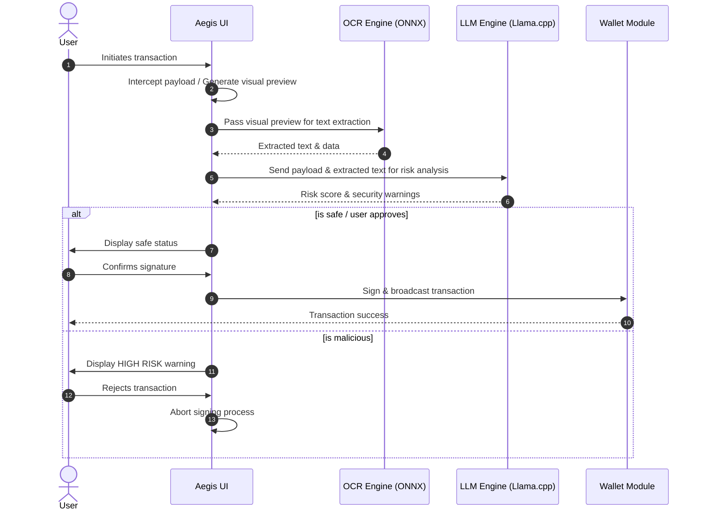
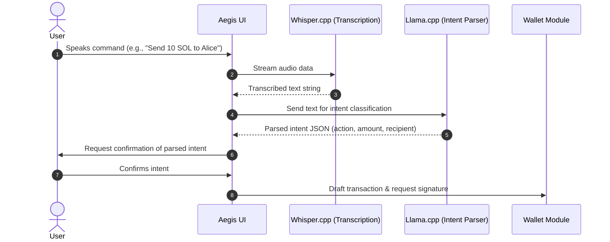
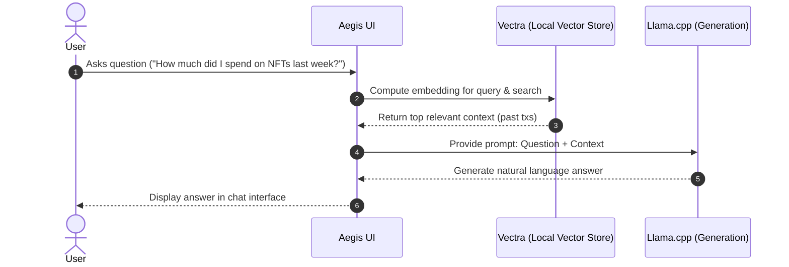

# Workflows

This document outlines the core operational workflows for the Aegis local-first AI features. All workflows execute entirely within the browser.

## Sign Guard Workflow

Sign Guard protects users from malicious transactions by locally analyzing the transaction data before signing.

## Voice Commander Workflow

Voice Commander allows users to execute wallet operations using natural language speech, transcribed and parsed locally.

## Portfolio Brain (RAG) Workflow

Portfolio Brain provides an intelligent chat interface that is aware of the user's past transactions, balances, and custom notes using a local vector database.

